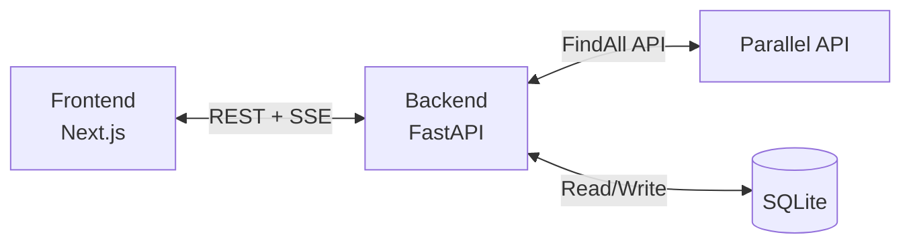

# Apartment Finder Web

AI-powered apartment search that discovers and verifies real listings using the Parallel API.

[](LICENSE)
[](https://github.com/elijahgjacob/apartment-finder-web/actions/workflows/ci.yml)
[](https://python.org)
[](https://nodejs.org)

<!-- TODO: Add screenshot -->

## Architecture



The backend uses a **Routes-Controllers-Services-Repositories** (RCSR) pattern. The frontend is built with the **Next.js App Router**, React 19, and Tailwind CSS.

## Features

- **Automated search** — background loop discovers apartments across Zillow, Redfin, Apartments.com, Craigslist, and more
- **AI verification** — each candidate is validated against configurable match conditions (beds, budget, location, availability)
- **Real-time streaming** — results stream to the frontend via Server-Sent Events
- **Interactive map** — browse verified listings on a Leaflet map
- **Scoring engine** — listings scored 0-100 on recency, price fit, and commute distance
- **Monitoring** — continuous watch for new listings matching saved criteria
- **Manual search** — on-demand searches via the search bar

## Quick Start

### Prerequisites

- Python 3.12+
- Node.js 20+
- npm
- A [Parallel API key](https://platform.parallel.ai)

### Setup

```bash
git clone https://github.com/elijahgjacob/apartment-finder-web.git
cd apartment-finder-web

# Install dependencies
make install

# Configure backend
cp backend/.env.example backend/.env
# Edit backend/.env and set PARALLEL_API_KEY

# Start development servers
make dev
```

The backend runs at http://localhost:8000 and the frontend at http://localhost:3000.

## Project Structure

```
apartment-finder-web/
├── backend/                 # FastAPI backend
│   ├── app/
│   │   ├── routes/          # HTTP route definitions
│   │   ├── controllers/     # Request validation
│   │   ├── services/        # Business logic + Parallel API
│   │   ├── repositories/    # SQLite data access
│   │   ├── models/          # Pydantic models
│   │   ├── middleware/      # Auth, CORS
│   │   └── utils/           # Helpers
│   ├── tests/
│   ├── Dockerfile
│   ├── requirements.txt
│   └── .env.example
├── frontend/                # Next.js frontend
│   ├── src/
│   │   ├── app/             # Pages and layouts
│   │   ├── components/      # UI components
│   │   ├── hooks/           # Custom React hooks
│   │   ├── lib/             # API client, utilities
│   │   ├── providers/       # Context providers
│   │   └── types/           # TypeScript types
│   ├── public/
│   ├── next.config.ts
│   └── package.json
├── docker-compose.yml
├── Makefile
└── README.md
```

## Configuration

All backend configuration is via environment variables. See [`backend/.env.example`](backend/.env.example) for the full reference.

Key variables:

| Variable | Description |
|---|---|
| `PARALLEL_API_KEY` | API key from platform.parallel.ai (required) |
| `SEARCH_QUERY` | Default background search query |
| `SEARCH_BUDGET` | Maximum monthly rent |
| `SEARCH_INTERVAL_SECONDS` | Background search interval |

## Available Commands

| Command | Description |
|---|---|
| `make dev` | Run backend and frontend concurrently |
| `make install` | Install all dependencies |
| `make lint` | Lint backend and frontend |
| `make test` | Run all tests |
| `make fmt` | Auto-format all code |
| `make build` | Build the frontend for production |
| `make clean` | Remove build artifacts |

## Deployment

See [DEPLOY.md](DEPLOY.md) for deployment instructions including Docker Compose, Fly.io, and Vercel options.

## Contributing

See [CONTRIBUTING.md](CONTRIBUTING.md) for development setup, code style, and PR guidelines.

## License

This project is licensed under the MIT License. See [LICENSE](LICENSE) for details.
