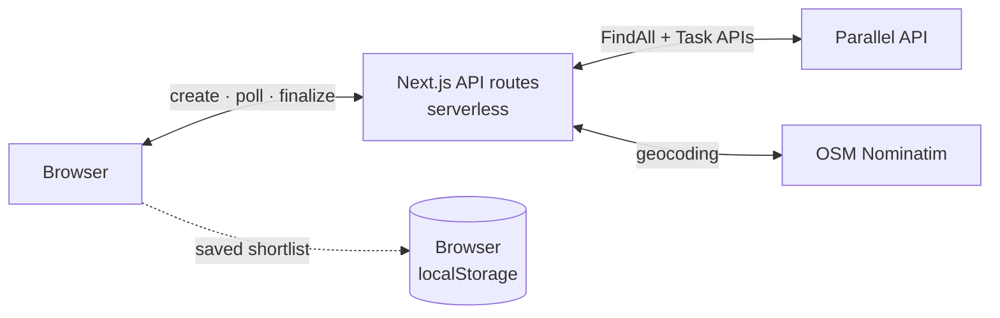

# Apartment Finder Web

AI-powered apartment search that discovers and verifies real listings using the Parallel API.

[](LICENSE)
[](https://github.com/elijahgjacob/apartment-finder-web/actions/workflows/ci.yml)
[](https://nodejs.org)

**Live demo:** https://apartment-finder-web.vercel.app

## Architecture



A **single Next.js app** — all server logic lives in serverless API routes
(`src/app/api/*`) that call the Parallel API directly. There is no separate
backend, no database, and no long-lived connections: the client drives each
search (create → poll → enrich → finalize), every step a short serverless
call. The only persistence is a user's saved shortlist, kept in their own
browser (localStorage) and never sent to any server.

The frontend is built with the **Next.js App Router**, React 19, and Tailwind CSS.

## Features

- **Natural-language search** — describe what you want; it becomes a Parallel FindAll run with explicit match conditions
- **AI verification** — each candidate is validated against configurable match conditions (beds, budget, location, availability)
- **Live results** — verified listings appear in the grid the moment FindAll confirms them, then enrich in place (price, beds, address, 18 fields)
- **Fraud check** — a second, user-triggered run re-verifies untrusted-source listings via the Parallel Task API against fact-based scam signals (off-platform payment, owner abroad, withheld address, no viewings, unusual incentives)
- **Interactive map** — browse verified listings on a Leaflet map (coordinates resolved via OSM Nominatim during the search)
- **Scoring engine** — listings scored 0-100 on price fit and proximity to the reference point
- **Saved targets** — star listings you want to keep; the shortlist lives in your browser only

## Quick Start

### Prerequisites

- Node.js 20+
- A [Parallel API key](https://platform.parallel.ai)

### Setup

```bash
git clone https://github.com/elijahgjacob/apartment-finder-web.git
cd apartment-finder-web/frontend

npm install
echo "PARALLEL_API_KEY=your-key-here" > .env.local
npm run dev
```

The app runs at http://localhost:3000 — no other process needed.

### Deploy

Deploys to Vercel as a single project (`frontend/` is the root directory).
Set `PARALLEL_API_KEY` in the project's environment variables.

```bash
cd frontend && npx vercel deploy --prod
```

## Project Structure

```
apartment-finder-web/
├── frontend/                    # The app (Next.js — this is everything)
│   ├── src/
│   │   ├── app/                 # Pages and layouts
│   │   │   └── api/             # Serverless API routes
│   │   │       ├── config/      # App config (env-driven)
│   │   │       ├── search/      # FindAll: create / poll / enrich / finalize
│   │   │       ├── verify/      # Task API fraud check: create / poll
│   │   │       └── debug/       # Stub for the /docs live tab
│   │   ├── components/          # UI components
│   │   ├── hooks/               # use-search (search state machine), use-saved-targets
│   │   ├── lib/
│   │   │   └── server/          # Parallel client, parsing/scoring, geocoding, config
│   │   ├── providers/           # Context providers
│   │   └── types/               # TypeScript types
│   ├── public/
│   ├── next.config.ts
│   └── package.json
├── backend/                     # Legacy FastAPI implementation (unused by the app)
└── README.md
```

## Configuration

All configuration is via environment variables on the Next.js app (locally in
`frontend/.env.local`, on Vercel in project settings).

Key variables:

| Variable | Description |
|---|---|
| `PARALLEL_API_KEY` | API key from platform.parallel.ai (required) |
| `CITY` / `CITY_SHORT` | Default city a search targets (users can override per search) |
| `SEARCH_BUDGET` | Default maximum monthly rent |
| `RENT_FLOORS` | Typical rent by bedroom count (drives auto-budget + scoring) |
| `FINDALL_GENERATOR` | FindAll generator tier (`base` default, `pro` for exhaustive) |
| `FINDALL_MATCH_LIMIT` | Max verified listings per search (default 8) |

See [`frontend/src/lib/server/config.ts`](frontend/src/lib/server/config.ts) for the full reference.

## Contributing

See [CONTRIBUTING.md](CONTRIBUTING.md) for development setup, code style, and PR guidelines.

## License

This project is licensed under the MIT License. See [LICENSE](LICENSE) for details.
